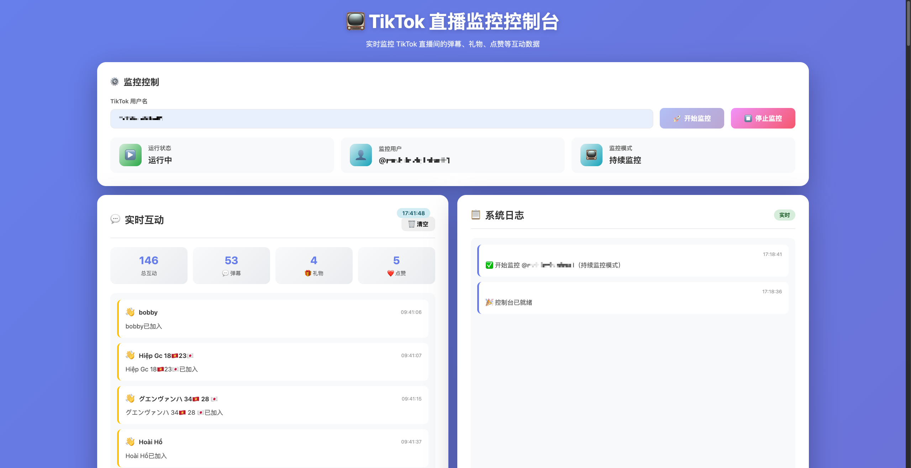

# TikTok 直播监控器

🎯 **基于 undetected-chromedriver 的 TikTok 直播数据采集工具**

[](https://www.python.org/)
[](LICENSE)



---

## 特性

- ✅ **完全绕过检测** - 使用 undetected-chromedriver 成功绕过 TikTok 反爬虫
- ✅ **自动关闭登录弹窗** - 智能检测并自动关闭TikTok登录弹窗，确保直播画面不被遮挡
- ✅ **页面错误自动恢复** - 检测到"我们遇到了一些问题"等页面错误时自动刷新，最多重试3次
- ✅ **实时互动监控** - 实时捕获并在控制台显示弹幕、礼物、点赞等直播互动
- ✅ **JavaScript Hook** - 注入脚本拦截 WebSocket、Fetch、XHR，实时捕获数据
- ✅ **模块化设计** - 清晰的分层架构，职责分离，易于扩展
- ✅ **类型安全** - 完整的类型提示，支持 IDE 智能提示
- ✅ **异常处理** - 分层异常系统，错误追踪清晰
- ✅ **日志系统** - 完整的日志记录，支持调试和监控
- ✅ **多种模式** - 支持单次采集、持续监控、多用户监控、Hook 采集

---

## 快速开始

### 安装

```bash
# 克隆项目
git clone <repository-url>
cd tiktok_live_fetch

# 安装依赖
uv sync
```

### 方式 1: Web 控制台（推荐）⭐

最简单的使用方式，通过 Web 界面控制监控：

```bash
# 启动 Web 控制台
uv run python app/web_server.py
```

然后在浏览器中访问 **http://localhost:5001/**

**功能特性**：
- ✅ **简单易用** - 只需输入 TikTok 用户名即可启动监控
- ✅ **持续监控** - 自动持续监控直到手动停止
- ✅ **实时显示** - 每 0.5 秒刷新，实时显示弹幕、礼物、点赞等互动
- ✅ **美观界面** - 现代化设计，不同类型互动有不同颜色标识
- ✅ **统计数据** - 实时统计总互动数、弹幕数、礼物数等
- ✅ **验证码处理** - 自动检测验证码，支持手动处理

**互动类型识别**：
- 💬 **弹幕** - 蓝色边框
- 🎁 **礼物** - 红色边框
- ❤️ **点赞** - 粉色边框
- ➕ **关注** - 绿色边框
- 🔗 **分享** - 青色边框
- 👋 **进场** - 黄色边框

### 方式 2: 命令行

```bash
# 监控用户，默认 60 秒，实时显示直播互动
uv run python main.py piicha02

# 自定义参数
uv run python main.py piicha02 --duration 300 --interval 30

# 单次采集
uv run python main.py piicha02 --single
```

**实时互动输出示例**：
```
📺 实时互动监控已启动（按 Ctrl+C 停止）
================================================================================

💬 [15:23:45] 用户A: 主播加油！
🎁 [15:23:47] 用户B: 送出玫瑰 x1
❤️  [15:23:48] 点赞了
👋 [15:23:50] 用户D 进入直播间
💬 [15:23:52] 用户E: 666666
```

### 方式 3: Python API

```python
from tiktok_monitor import LiveCollector, MonitorConfig

# 创建配置
config = MonitorConfig(
    username="tkb_no_kyoi",
    monitor_duration=60,
    collect_interval=10,
)

# 运行采集器
collector = LiveCollector(config)
collector.run()
```

## 架构

### 模块结构

**Web 控制台（Flask + 前端）**

```
app/
├── __init__.py      # Flask 包初始化
├── api_server.py    # Web API，负责调用采集器
├── index.html       # 控制台前端页面
└── web_server.py    # Web 控制台启动脚本
```

**采集器核心逻辑**

```
tiktok_monitor/
├── __init__.py      # 包入口，导出所有公共 API
├── config.py        # 配置管理 (MonitorConfig)
├── models.py        # 数据模型 (PageSnapshot, MonitorSession, LiveRoomInfo)
├── browser.py       # 浏览器管理 (BrowserManager)
├── parser.py        # 数据解析 (PageParser, DataExtractor)
├── formatter.py     # 结果格式化 (ResultFormatter)
├── collector.py     # 核心采集器 (LiveCollector)
├── hooks.py         # ⭐ JavaScript Hook 注入器 (JavaScriptHook)
├── exceptions.py    # 异常定义
└── logger.py        # 日志管理
```

### 设计原则

- **单一职责** - 每个模块只负责一个功能
- **依赖注入** - 通过构造函数注入依赖
- **接口隔离** - 清晰的公共 API
- **开闭原则** - 对扩展开放，对修改关闭

---

## JavaScript Hook 功能 ⭐

### 什么是 Hook？

通过在页面中注入 JavaScript 代码，可以拦截和捕获：
- **WebSocket 消息** - 实时评论、礼物、点赞等
- **Fetch/XHR 请求** - API 数据、直播间信息
- **DOM 事件** - 页面交互、用户行为

### 使用 Hook

#### 方式 1: 独立使用 Hook

```python
from tiktok_monitor import MonitorConfig, JavaScriptHook
from tiktok_monitor.browser import BrowserManager

config = MonitorConfig(username="tkb_no_kyoi")
browser = BrowserManager(config)

browser.start()
browser.visit_homepage()

# 创建并安装 Hook
hook = JavaScriptHook(browser.driver)
hook.install_all_hooks()  # 安装所有 Hook
hook.inject_data_extractor()  # 注入数据提取器

# 访问直播间
browser.visit_live_room()

# 等待数据捕获
import time
time.sleep(30)

# 获取捕获的数据
ws_messages = hook.get_websocket_messages()
fetch_requests = hook.get_fetch_requests()
comments = hook.extract_comments()

print(f"捕获 {len(ws_messages)} 条 WebSocket 消息")
print(f"捕获 {len(fetch_requests)} 个 API 请求")
```

### Hook 功能详解

| Hook 类型 | 功能 | 捕获数据 |
|----------|------|---------|
| **Login Modal Closer** | 🆕 自动关闭登录弹窗 | 检测并自动关闭TikTok登录对话框 |
| **WebSocket Hook** | 拦截 WebSocket 消息 | 实时评论、礼物、点赞、进入等 |
| **Fetch Hook** | 拦截 fetch 请求 | API 响应数据 |
| **XHR Hook** | 拦截 XMLHttpRequest | API 响应数据 |
| **Event Hook** | 监听 DOM 变化 | 页面交互事件 |
| **Data Extractor** | 直接提取页面数据 | window 对象中的数据 |

### 🆕 登录弹窗自动关闭功能

TikTok 直播间有时会弹出登录对话框，遮挡直播画面和评论区。本工具已内置智能检测和自动关闭功能：

**工作原理**：
1. 通过 MutationObserver 实时监听 DOM 变化
2. 自动检测登录弹窗的出现（通过多种选择器）
3. 自动点击关闭按钮或触发 ESC 键
4. 在页面加载后的 1秒、3秒、5秒自动尝试关闭

**特点**：
- ✅ 完全自动化，无需手动干预
- ✅ 支持多种关闭按钮选择器
- ✅ 实时监听，弹窗出现后立即关闭
- ✅ 不影响其他功能，静默运行

**技术实现**：
```javascript
// 监听登录弹窗出现
MutationObserver → 检测 #login-modal → 查找关闭按钮 → 自动点击
```

---

## 核心 API

### MonitorConfig - 配置类

```python
config = MonitorConfig(
    username="tkb_no_kyoi",      # 必填：TikTok 用户名
    window_size=(1920, 1080),    # 浏览器窗口大小
    headless=False,              # Headless 模式（不推荐）
    monitor_duration=60,         # 监控时长（秒）
    collect_interval=10,         # 采集间隔（秒）
)
```

### LiveCollector - 采集器类

```python
collector = LiveCollector(config)

# 完整监控流程
collector.run()

# 单次采集
collector.run_single_collect()

# 分步执行
collector.initialize()      # 初始化
collector.prepare()          # 准备
collector.collect_once()     # 采集一次
collector.monitor()          # 持续监控
collector.finalize()         # 完成并保存
collector.cleanup()          # 清理资源
```

### 异常处理

```python
from tiktok_monitor import (
    LiveCollector,
    MonitorConfig,
    BrowserError,
    ParserError,
    StorageError,
    CollectionError,
)

try:
    collector = LiveCollector(config)
    collector.run()
except BrowserError as e:
    print(f"浏览器错误: {e}")
except ParserError as e:
    print(f"解析错误: {e}")
except StorageError as e:
    print(f"存储错误: {e}")
except CollectionError as e:
    print(f"采集错误: {e}")
```

### 日志管理

```python
from tiktok_monitor import logger

# 使用日志
logger.info("开始采集")
logger.warning("警告信息")
logger.error("错误信息")

# 添加文件日志
from pathlib import Path
logger.add_file_handler(Path("logs/monitor.log"))
```

---

## 采集的数据

### PageSnapshot - 页面快照

```json
{
  "timestamp": "2025-11-12T20:00:00",
  "has_video": true,
  "has_error_message": false,
  "has_live_content": true,
  "element_count": 940,
  "html_size": 311245
}
```

### MonitorSession - 监控会话

```json
{
  "username": "tkb_no_kyoi",
  "start_time": "2025-11-12T20:00:00",
  "end_time": "2025-11-12T20:05:00",
  "total_snapshots": 6,
  "healthy_snapshots": 6,
  "snapshots": [...]
}
```

---

## 部署

### 方式 1: Docker（推荐）

#### 基础使用

```bash
# 构建镜像
docker build -t tiktok-live-monitor .

# 运行（默认监控 tkb_no_kyoi 用户 60 秒）
docker run --rm \
  -e USE_XVFB=true \
  tiktok-live-monitor

# 自定义参数
docker run --rm \
  -e USE_XVFB=true \
  tiktok-live-monitor \
  uv run python main.py your_username --duration 120 --interval 15
```

#### 使用 Docker Compose（更简单）

```bash
# 默认监控服务
docker-compose up

# 自定义参数（通过环境变量）
TIKTOK_USERNAME=your_username \
MONITOR_DURATION=120 \
COLLECT_INTERVAL=15 \
docker-compose --profile custom up tiktok-monitor-custom

# 后台运行
docker-compose up -d

# 查看日志
docker-compose logs -f

# 停止
docker-compose down
```

#### 环境变量配置

创建 `.env` 文件（可选）：

```bash
# TikTok 配置
TIKTOK_USERNAME=tkb_no_kyoi
MONITOR_DURATION=60
COLLECT_INTERVAL=10

# 容器配置
USE_XVFB=true
```

### 方式 2: Linux 服务器（使用 Xvfb）

```bash
# 安装依赖
sudo apt-get update
sudo apt-get install -y xvfb google-chrome-stable

# 安装 Python 依赖
uv sync

# 使用 Xvfb 运行
xvfb-run python main.py tkb_no_kyoi

# 或者手动启动 Xvfb
Xvfb :99 -screen 0 1920x1080x24 &
export DISPLAY=:99
python main.py tkb_no_kyoi
```

### 方式 3: 本地开发（支持 macOS / Linux / Windows）

```bash
# 克隆项目
git clone <repository-url>
cd tiktok_live_fetch

# 安装依赖
uv sync

# 直接运行（自动使用系统 Chrome）
uv run python main.py __mizuki616 --single

# 持续监控（60 秒，每 10 秒采集一次）
uv run python main.py __mizuki616

# 自定义参数
uv run python main.py __mizuki616 --duration 300 --interval 30
```

**说明**：
- 程序会自动使用系统安装的 Chrome 浏览器
- undetected-chromedriver 会自动匹配 Chrome 版本并下载对应的 ChromeDriver
- macOS 上经过测试可以成功访问 TikTok 直播间并采集数据
- 不需要手动下载 Chrome 或 ChromeDriver

### 容器环境说明

在容器中运行时，程序会自动检测并应用以下优化：

- ✅ **自动检测容器环境** - 检测 `/.dockerenv`、`/proc/1/cgroup` 等
- ✅ **Xvfb 虚拟显示支持** - 通过 `USE_XVFB` 环境变量启用
- ✅ **优化的浏览器配置** - 容器友好的 Chrome 参数
- ✅ **自动创建输出目录** - 数据持久化到挂载卷

---

## 当前状态

### ✅ macOS 本机 Chrome 支持（推荐）

**版本**: Chrome 142.0.7444.135 + undetected-chromedriver 3.5.5

**状态**: ✅ 成功运行

**验证结果**（2025-11-12 22:38）:
- ✅ **成功访问 TikTok 直播间**
- ✅ **成功绕过反爬虫检测**
- ✅ **完整捕获直播间数据**
- ✅ **DOM 元素**: 942 个（完整加载）
- ✅ **视频元素**: 正常显示
- ✅ **直播内容**: 完整捕获
- ✅ **截图保存**: 正常
- ✅ **初始化数据**: 成功提取（268KB）

**关键改进**：
1. 移除了 `use_subprocess` 参数，使用默认模式更稳定
2. 浏览器启动后立即访问 Google 首页，保持浏览器活跃
3. 使用 `--start-maximized` 参数优化窗口显示
4. 增加等待时间，确保页面完全加载

**使用方法**：
```bash
# 直接运行，自动使用系统 Chrome
uv run python main.py __mizuki616 --single
```

### Docker 环境支持

Docker 镜像已内置 Chrome 131，可在 Linux 服务器上运行：

```bash
docker-compose up
```

---

## 技术方案

### 为什么选择 undetected-chromedriver？

| 指标 | Playwright | undetected-chromedriver |
|------|-----------|------------------------|
| TikTok 检测 | ❌ 被检测 | ✅ **成功绕过** |
| 推荐列表 | ❌ 未加载 | ✅ **完整显示** |
| HTML 大小 | 260KB | **311KB** (+20%) |
| DOM 元素 | 470 | **940** (+100%) |

---

## 路线图

### v1.0.0（当前）

- [x] 核心采集功能
- [x] 模块化架构
- [x] 异常处理系统
- [x] 日志管理
- [x] 命令行接口
- [x] JavaScript Hook 功能
- [x] Docker 容器化支持
- [x] Chrome 131 兼容性支持
- [x] 实时互动监控（弹幕、礼物、点赞等）
- [x] 用户名参数化输入

### v1.1.0 - 验证码自动识别（计划中）

- [ ] **集成验证码接码平台** - 接入 [极验云码](https://www.jfbym.com/) 等打码平台
  - [ ] 支持 TikTok 滑动拼图验证码自动识别 ([接口文档](https://www.jfbym.com/test/95.html))
  - [ ] 验证码图片自动上传
  - [ ] 坐标自动回调
  - [ ] 多平台支持（极验云码、2Captcha、Anti-Captcha）
  - [ ] 失败重试机制
- [ ] **验证码配置优化**
  - [ ] 支持配置接码平台 API Key
  - [ ] 支持手动/自动模式切换
  - [ ] 验证码处理超时配置
- [ ] WebSocket Protobuf 解析优化
- [ ] 更多互动类型支持（分享、关注等）

### v1.2.0

- [ ] 数据持久化到数据库（SQLite/PostgreSQL）
- [ ] 多直播间并发监控
- [ ] 性能优化与资源管理

### v2.0.0

- [ ] 完整的 Web 管理界面
- [ ] 数据分析与可视化
- [ ] 实时推送通知（Webhook/WebSocket）
- [ ] 云端部署方案

---

## 贡献

欢迎提交 Issue 和 Pull Request！

---

## 许可证

MIT License

---

**版本**: 1.0.0
**最后更新**: 2025-11-12
**状态**: ✅ 功能完整（✅ macOS 本机 Chrome 支持）
